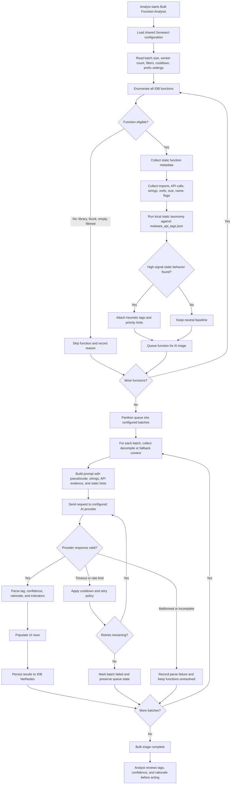
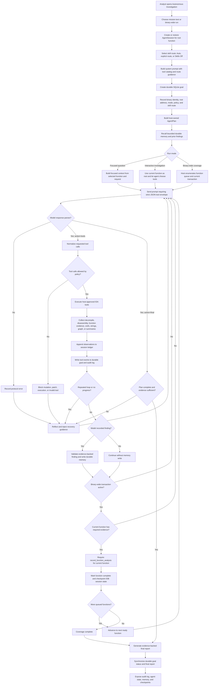

# Analysis Pipelines

Genesect implements three primary automated analysis engines: the Bulk Analyzer, the Deep Analyzer, and Autonomous Investigation.

*   **Bulk Analyzer:** Optimized for rapid, breadth-first triage of the entire binary.
*   **Deep Analyzer:** Optimized for thorough, depth-first analysis of a specific execution chain.
*   **Autonomous Investigation:** Optimized for interactive or binary-wide agentic analysis with host-owned plans, durable goals, evidence memory, and audited tool use.

## Bulk Function Analyzer Pipeline

The Bulk Function Analyzer is designed to quickly classify every function within a binary against established malware behavior profiles.

### Execution Flow

1.  **Function Enumeration:** The engine scans the IDB and retrieves all defined functions.
2.  **Filtration:** System libraries, API thunks, and null-code functions are optionally excluded based on configuration parameters.
3.  **Static Pre-Classification:** Functions are evaluated against a localized static taxonomy (`malware_api_tags.json`). This heuristic phase identifies known-malicious Windows API combinations without requiring an external AI request.
4.  **Batch AI Processing:** Functions are grouped into configurable batches. The decompiled pseudocode, string references, and API call lists are transmitted to the AI provider.
5.  **State Application:** The analytical verdict (Tag, Confidence Score, and Rationale) is populated in the user interface and committed to the IDB via NetNodes.
6.  **Fault Tolerance:** Requests resulting in timeouts or API rate-limit errors are automatically requeued for execution.

## Deep Analyzer Pipeline

The Deep Analyzer executes a comprehensive, multi-stage recursive analysis originating from a user-defined entry point. It constructs a call graph, performs bottom-up symbolic renaming, conducts behavioral analysis, and synthesizes a standalone HTML report.

```mermaid
flowchart TD
    A["Analyst selects entry function"] --> B["Open Deep Analyzer"]
    B --> C["Load provider, analysis limits, rename options, report settings"]
    C --> D{"Provider configured and reachable?"}
    D -- "No" --> E["Stop and show configuration error"]
    D -- "Yes" --> F["Create analysis workspace beside IDB"]
    F --> G["Initialize logs, cache folders, report assets, and state files"]
    G --> H["Build bounded call graph from entry function"]
    H --> I{"Graph limit reached?"}
    I -- "Yes" --> J["Truncate graph at configured depth or node ceiling"]
    I -- "No" --> K["Keep full discovered graph"]
    J --> L["Classify nodes by depth, callers, callees, library status"]
    K --> L
    L --> M["Order nodes leaf-first for bottom-up normalization"]
    M --> N{"Variable renaming enabled?"}
    N -- "Yes" --> O["Run Bulk Variable Renamer on eligible functions"]
    N -- "No" --> P["Skip variable normalization"]
    O --> Q{"Apply variable suggestions?"}
    Q -- "Yes" --> R["Commit reviewed variable names to IDB"]
    Q -- "No" --> S["Keep suggestions in analyzer state"]
    P --> T["Prepare function rename pass"]
    R --> T
    S --> T
    T --> U{"Function renaming enabled?"}
    U -- "Yes" --> V["Analyze callees first and propose semantic names"]
    U -- "No" --> W["Skip function rename pass"]
    V --> X{"Apply function names?"}
    X -- "Yes" --> Y["Commit reviewed names to IDB"]
    X -- "No" --> Z["Keep proposed names in report context"]
    W --> AA["Begin per-function behavioral analysis"]
    Y --> AA
    Z --> AA
    AA --> AB["Generate readable code or collect Hex-Rays pseudocode"]
    AB --> AC["Collect strings, APIs, callers, callees, comments, and prior results"]
    AC --> AD["Assign baseline risk and extract candidate IOCs"]
    AD --> AE{"Function analyzed successfully?"}
    AE -- "No" --> AF["Record error and continue with fallback context"]
    AE -- "Yes" --> AG["Persist function analysis in workspace state"]
    AF --> AH{"More graph nodes?"}
    AG --> AH
    AH -- "Yes" --> AB
    AH -- "No" --> AI["Run contextual refinement from entry and caller relationships"]
    AI --> AJ["Propagate behavior, downgrade false positives, upgrade utility functions used maliciously"]
    AJ --> AK["Aggregate IOCs, risk tags, MITRE ATT&CK mappings, and function summaries"]
    AK --> AL["Build report tables, graph data, and visual sections"]
    AL --> AM["Write standalone HTML report"]
    AM --> AN["Open or reveal report artifact for analyst review"]
```

### Phase 1: Discovery & Preparation

*   **Stage 1: Workspace Initialization**
    Creates isolated workspace directories adjacent to the IDB. Validates AI provider configuration, checks dependencies, and establishes the operational environment.
*   **Stage 2: Graph Construction**
    Recursively traverses the cross-reference engine originating from the entry point. Constructs a deterministic `FuncNode` graph detailing caller/callee relationships, execution depth, and library boundaries.
*   **Stage 3: Symbolic Normalization (Bottom-Up)**
    Executes the Bulk Variable and Bulk Function renaming engines sequentially, starting from leaf functions. This ensures that when a caller is analyzed, its callees have already been semantically named.

### Phase 2: Contextual Analysis & Reporting

*   **Stage 4: Code Reconstruction & Baseline Assessment**
    Translates the Hex-Rays pseudocode into high-level, readable C. Executes a preliminary behavioral assessment to assign risk tags (`malicious`, `suspicious`, `benign`) and extract initial indicators.
*   **Stage 5: Contextual Refinement**
    Re-evaluates each function utilizing the behavioral context derived from its callers. This stage upgrades benign-looking utility functions called maliciously, downgrades false positives, and propagates behavioral intent across the execution chain.
*   **Stage 6: Data Synthesis**
    Aggregates the analytical output, extracts functional Indicators of Compromise (IOCs), maps behaviors to the MITRE ATT&CK framework, and generates the data structures required for visualization.
*   **Stage 7: Analysis Report Generation**
    Compiles a self-contained HTML report detailing the executive summary, MITRE ATT&CK coverage, function-level risk assessments, extracted IOCs, and interactive control flow diagrams. The report is deposited in the initialized workspace directory.

## Autonomous Investigation Pipeline

The Autonomous Investigation engine runs an evidence-driven agent inside IDA. It can answer focused analyst questions, investigate a selected function, or perform binary-wide coverage by repeatedly selecting host-approved tools, validating evidence, recording findings, and updating durable state.

### Phase 1: Run Initialization

*   **Agent Session Creation**
    Creates or restores an `AgentSession` for the selected root function. The session tracks observations, successful tool capabilities, findings, examined addresses, function coverage, and final reports.
*   **Skill Route Selection**
    Applies a compact guidance route before the first model turn. `Skill: Auto` selects a route from the analyst objective, while manual routes cover Triage Router (`triage-router`), Malware Reverse Engineering (`malware-re`), IOC Extraction (`ioc-report`), Packing And Unpacking (`unpacking`), Go/Rust User Code (`go-rust`), C++ Virtual Dispatch (`cpp-vtable`), or a skills-off baseline.
*   **Durable Goal Registration**
    Creates a SQLite-backed durable goal under the user's Genesect agent memory directory. The goal stores project identity, root address, run mode, status, timestamps, metadata, tool steps, events, and findings.
*   **Host-Owned Planning**
    Builds an `AgentPlan` for the run mode (`focused`, `interactive`, `autonomous_full`, or `legacy_bulk`). The plan is injected into prompts and exported into audit logs so progress is owned by the host rather than only by model prose.
*   **Memory Recall**
    Queries durable cross-project memory for relevant prior findings and function summaries. Matching memory is provided as bounded context at the start of the run.

### Phase 2: Tool-Driven Evidence Collection

*   **Strict Tool Envelope Parsing**
    Model responses are parsed as JSON envelopes with `action=tools` or `action=final`. If the provider wraps a valid envelope in prose, the parser recovers the final valid agent envelope while still rejecting unrelated JSON snippets.
*   **Policy and Tool Validation**
    Each requested tool is normalized and checked against the agent policy. IDA-mutating actions, patching, and execution-class operations remain gated by policy and the user's IDA-changes opt-in.
*   **Evidence Ledger Updates**
    Tool results are recorded into the session observation ledger, the durable event log, and the tool audit trail. Repeated calls can be redirected, replayed from cache, or blocked to avoid infinite loops.
*   **Function Transaction Control**
    In binary-wide mode, the host supplies one ready function at a time. The agent must collect `function_evidence` plus `decompile` or `disassemble`, then call `record_function_analysis` before advancing.

### Phase 3: Reflection, Memory, and Recovery

*   **Self-Reflection**
    The host reflector detects repeated tool loops, no-progress rounds, protocol errors, coverage gaps, and blocked plan steps. Recovery guidance is injected into the next prompt turn.
*   **Durable Memory Writes**
    Evidence-backed `record_finding` calls and completed function analyses are written to cross-project SQLite memory. Later investigations can recall these records through `search_findings` or startup memory hints.
*   **Goal Checkpointing**
    Session state is checkpointed into the IDB, while goal status and metadata are synchronized to the durable goal store. Paused, stopped, and completed runs preserve their state outside the active UI.
*   **Audit and State Export**
    The Audit Log exports model protocol, tool decisions, agent events, reflections, plan state, durable goal events, and memory matches. The Agent State dialog exposes durable goals and memory independently of an active run.

## Pipeline Comparison

| Specification | Bulk Function Analyzer | Deep Analyzer | Autonomous Investigation |
|---|---|---|---|
| **Objective** | Breadth-first triage and classification | Depth-first deep investigation | Agentic evidence collection, focused answers, and binary-wide coverage |
| **Operational Scope** | Flat enumeration of all IDB functions | Bounded recursive graph from entry point | Selected root function, focused analyst request, or host-enumerated binary-wide function queue |
| **Analytical Depth** | Single-pass evaluation | Multi-stage contextual refinement | Iterative tool use with host-owned planning, reflection, and evidence validation |
| **Variable Renaming** | No | Yes (Bottom-up) | Optional, gated by the IDA-changes opt-in and host policy |
| **Code Reconstruction** | No | Yes (Readable C generation) | Uses Hex-Rays decompile as primary evidence; disassembly is used as fallback or verification |
| **Persistence Output** | IDB Tags and UI population | IDB modifications, disk artifacts, HTML Report | IDB checkpoints, durable SQLite goals, cross-project memory, audit logs, optional IDA changes |
| **Execution Velocity** | High (Parallel batch processing) | Low (Sequential, thorough analysis) | Variable; focused mode is fast, binary-wide autonomous mode is sequential and evidence-gated |
